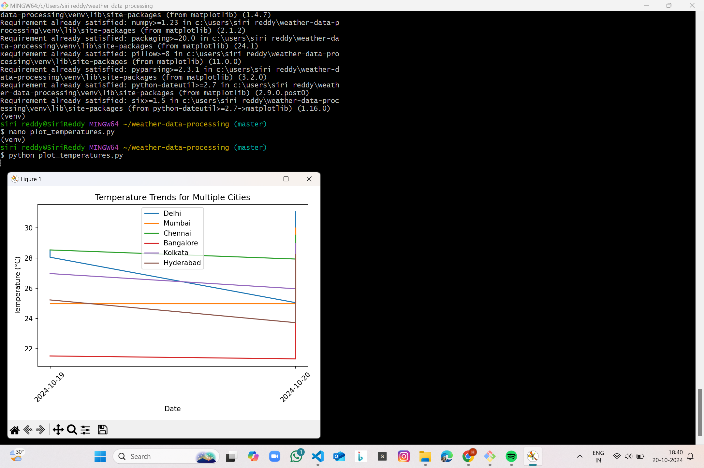

# Real-Time Data Processing System for Weather Monitoring with Rollups and Aggregates

## Overview

This project is designed to create a **Real-Time Weather Monitoring System** by fetching live weather data from the OpenWeatherMap API, processing it, and storing key weather insights. The system performs rollups, aggregations, and weather alerting based on customizable thresholds. The project includes various functionalities such as data fetching, temperature conversion, storing weather summaries in a database, and visualizing historical weather trends.

Below is a step-by-step guide to help you set up and run this system smoothly, including real-time data visualizations and weather alerts. Throughout this guide, I’ve included images of real-time outputs to make the process clear and easy to follow.

---

## Key Features

- Fetches weather data for multiple cities in India.
- Converts temperatures between Kelvin, Celsius, and Fahrenheit.
- Stores daily weather summaries in a database.
- Triggers alerts if certain weather thresholds are breached.
- Visualizes temperature trends and alerts.

---

## Table of Contents

- [Technologies Used](#technologies-used)
- [Installation](#installation)
- [Solution](#solution)
  - [API Connection](#api-connection)
  - [Fetch Weather Data](#fetch-weather-data)
  - [Store Weather Data](#store-weather-data)
  - [Temperature Conversion](#temperature-conversion)
  - [Weather Alerts](#weather-alerts)
  - [Visualization of Data](#visualization-of-data)
- [Testing](#testing)
- [Images](#images)

---

## Technologies Used

- **Python 3.x**: The core programming language used.
- **SQLite3**: Used for local database storage.
- **SQLAlchemy**: ORM for handling database interactions.
- **dotenv**: To securely manage API keys and environment variables.
- **matplotlib**: For data visualization.
- **OpenWeatherMap API**: Provides real-time weather data.

---

## Installation

To run this application, follow the steps below:

### 1. Clone the Repository

```bash
git clone https://github.com/yourusername/real-time-weather-monitoring.git
cd real-time-weather-monitoring
```

### 2. Install Dependencies

```bash
pip install -r requirements.txt
```

This will install the required libraries, such as `requests`, `dotenv`, `matplotlib`, and others.

### 3. Set Up Environment Variables

Create a `.env` file to securely store your API key.

```bash
touch .env
```

Now open the file and add your OpenWeatherMap API key:

```bash
nano .env
```

Insert the following code:

```
OPENWEATHER_API_KEY=your_api_key_here
```

Save and close the file.

---

## Solution

### API Connection

To fetch weather data, you first need to establish an API connection using the OpenWeatherMap API. In this step, we create a file called `.env` to store our API key securely.

#### Steps:
1. Create a `.env` file:
   ```bash
   touch .env
   ```
2. Edit the file:
   ```bash
   nano .env
   ```
3. Insert the following API key (replace `your_api_key_here` with your actual key):
   ```env
   OPENWEATHER_API_KEY=your_api_key_here
   ```

#### Example Code:

```python
import os
from dotenv import load_dotenv

load_dotenv()  # Load environment variables
api_key = os.getenv('OPENWEATHER_API_KEY')

if api_key:
    print("API key loaded successfully.")
else:
    print("Failed to load API key.")
```

---

### Fetch Weather Data

Fetching weather data is one of the core tasks of this project. We fetch data for multiple cities and print it in a readable format.

#### Steps:
1. Create a Python file for fetching data:
   ```bash
   nano fetch_weather_data.py
   ```
2. Add the following code to fetch data from the API for predefined cities:

```python
import os
import requests
from dotenv import load_dotenv

load_dotenv()
api_key = os.getenv('OPENWEATHER_API_KEY')

def get_weather_data(city):
    url = f"http://api.openweathermap.org/data/2.5/weather?q={city}&appid={api_key}&units=metric"
    response = requests.get(url)
    return response.json() if response.status_code == 200 else None

cities = ['Delhi', 'Mumbai', 'Chennai', 'Bangalore', 'Kolkata', 'Hyderabad']

for city in cities:
    data = get_weather_data(city)
    if data:
        print(f"City: {city}, Temp: {data['main']['temp']}°C, Weather: {data['weather'][0]['description']}")
    else:
        print(f"Failed to fetch data for {city}.")
```

3. Run the script:
   ```bash
   python fetch_weather_data.py
   ```

#### Expected Output:
Check the following image for expected output when the program fetches weather data.


---

### Store Weather Data

To persist weather data for further analysis, we store daily summaries in a SQLite database.

#### Steps:
1. Create a database for storing the data:
   ```bash
   sqlite3 weather_data.db
   ```
2. Create a Python file to handle the storage:
   ```bash
   nano store_weather_data.py
   ```
3. Add the following code:

```python
import sqlite3

def store_daily_summary(city, avg_temp, max_temp, min_temp, weather_condition):
    conn = sqlite3.connect('weather_data.db')
    c = conn.cursor()
    c.execute('''CREATE TABLE IF NOT EXISTS daily_summary (
                 city TEXT, date TEXT, avg_temp REAL, max_temp REAL, min_temp REAL, dominant_weather TEXT)''')
    c.execute('''INSERT INTO daily_summary (city, date, avg_temp, max_temp, min_temp, dominant_weather)
                 VALUES (?, date('now'), ?, ?, ?, ?)''', 
                 (city, avg_temp, max_temp, min_temp, weather_condition))
    conn.commit()
    conn.close()
```

4. Run the script to store weather data:
   ```bash
   python store_weather_data.py
   ```

#### Expected Output:
Weather data should now be stored in the database. Here’s an image showing the stored data.


---

### Temperature Conversion

The system allows users to convert temperature values based on their preference: Celsius, Fahrenheit, or Kelvin.

#### Steps:
1. Create a Python file for temperature conversion:
   ```bash
   nano convert_temperature.py
   ```
2. Add the following code:

```python
def convert_temperature(temp, unit):
    if unit == 'C':
        return temp - 273.15
    elif unit == 'F':
        return (temp - 273.15) * 9/5 + 32
    return temp
```

3. Run the conversion:
   ```bash
   python convert_temperature.py
   ```

#### Expected Output:


---

### Weather Alerts

Alerts are triggered if certain thresholds are exceeded, such as temperatures over 35°C.

#### Steps:
1. Create a Python file for weather alerts:
   ```bash
   nano weather_alerts.py
   ```
2. Add the following code:

```python
def check_alerts(city, temp):
    threshold = 35
    if temp > threshold:
        print(f"**ALERT**: {city} exceeded {threshold}°C!")
```

3. Run the alert script:
   ```bash
   python weather_alerts.py
   ```

#### Expected Output:


---

### Visualization of Data

To make sense of the stored weather data, we use `matplotlib` to visualize temperature trends over time.

#### Steps:
1. Create a Python file for data visualization:
   ```bash
   nano plot_weather_data.py
   ```
2. Add the following code:

```python
import matplotlib.pyplot as plt
import sqlite3

def plot_temperature_trends():
    conn = sqlite3.connect('weather_data.db')
    c = conn.cursor()
    c.execute('SELECT date, avg_temp FROM daily_summary')
    data = c.fetchall()

    dates = [row[0] for row in data]
    temps = [row[1] for row in data]

    plt.plot(dates, temps)
    plt.title('Temperature Trends')
    plt.show()
```

3. Run the visualization:
   ```bash
   python plot_weather_data.py
   ```

#### Expected Output:



---

## Testing

Testing each functionality is critical for ensuring proper system behavior. Below are a few key test cases:

1. **API Connection**: Verify that the system connects to the OpenWeatherMap API using a valid API key.
2. **Data Retrieval**: Simulate API calls and ensure correct parsing of the weather data.
3. **Temperature Conversion**: Test the conversion of temperatures based on user preference (Celsius, Fahrenheit).
4. **Weather Alerts**: Test if the system triggers alerts when temperature thresholds are breached.

---

## Images

Below are the paths to images used in this README for output visualization:

- Fetch Weather Data: `
